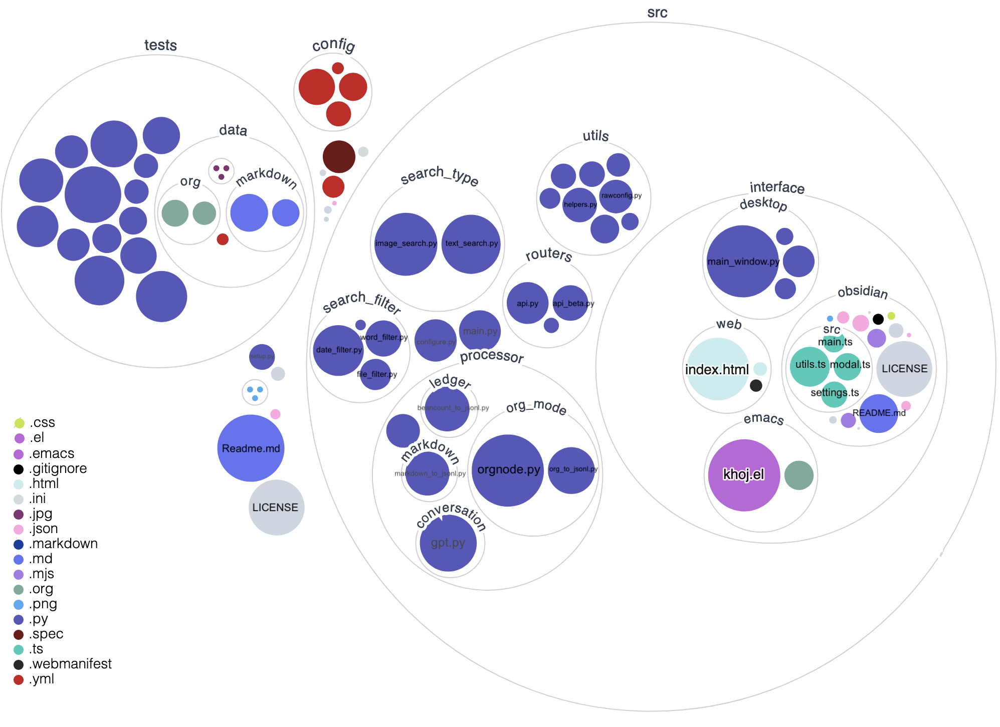

# Development

## Setup
### Using Pip
#### 1. Install

```shell
# Get Khoj Code
git clone https://github.com/khoj-ai/khoj && cd khoj

# Create, Activate Virtual Environment
python3 -m venv .venv && source .venv/bin/activate

# Install Khoj for Development
pip install -e .[dev]

# For MacOS or zsh users run this
pip install -e .'[dev]'

```

#### 2. Run
1. Start Khoj
   ```shell
   khoj -vv
   ```
2. Configure Khoj
   - **Via the Settings UI**: Add files, directories to index the [Khoj settings](http://localhost:42110/config) UI once Khoj has started up. Once you've saved all your settings, click `Configure`.
   - **Manually**:
     - Copy the `config/khoj_sample.yml` to `~/.khoj/khoj.yml`
     - Set `input-files` or `input-filter` in each relevant `content-type` section of `~/.khoj/khoj.yml`
       - Set `input-directories` field in `image` `content-type` section
     - Delete `content-type` and `processor` sub-section(s) irrelevant for your use-case
     - Restart khoj

  Note: Wait after configuration for khoj to Load ML model, generate embeddings and expose API to query notes, images, documents etc specified in config YAML

### Using Docker
#### 1. Clone

```shell
git clone https://github.com/khoj-ai/khoj && cd khoj
```

#### 2. Configure

- **Required**: Update [docker-compose.yml](https://github.com/khoj-ai/khoj/blob/master/docker-compose.yml) to mount your images, (org-mode or markdown) notes, PDFs and Github repositories
- **Optional**: Edit application configuration in [khoj_docker.yml](https://github.com/khoj-ai/khoj/blob/master/config/khoj_docker.yml)

#### 3. Run

```shell
docker-compose up -d
```

*Note: The first run will take time. Let it run, it\'s mostly not hung, just generating embeddings*

#### 4. Upgrade

```shell
docker-compose build --pull
```

## Validate
### Before Making Changes
1. Install Git Hooks for Validation
   ```shell
   pre-commit install -t pre-push -t pre-commit
   ```
   - This ensures standard code formatting fixes and other checks run automatically on every commit and push
   - Note 1: If [pre-commit](https://pre-commit.com/#intro) didn't already get installed, [install it](https://pre-commit.com/#install) via `pip install pre-commit`
   - Note 2: To run the pre-commit changes manually, use `pre-commit run --hook-stage manual --all` before creating PR

### Before Creating PR

1. Run Tests. If you get an error complaining about a missing `fast_tokenizer_file`, follow the solution [in this Github issue](https://github.com/UKPLab/sentence-transformers/issues/1659).
   ```shell
   pytest
   ```

2. Run MyPy to check types
   ```shell
   mypy --config-file pyproject.toml
   ```

### After Creating PR
- Automated [validation workflows](.github/workflows) run for every PR.

  Ensure any issues seen by them our fixed

- Test the python packge created for a PR
  1. Download and extract the zipped `.whl` artifact generated from the pypi workflow run for the PR.
  2. Install (in your virtualenv) with `pip install /path/to/download*.whl>`
  3. Start and use the application to see if it works fine

## Create Khoj Release
Follow the steps below to [release](https://github.com/debanjum/khoj/releases/) Khoj. This will create a stable release of Khoj on [Pypi](https://pypi.org/project/khoj-assistant/), [Melpa](https://stable.melpa.org/#%252Fkhoj) and [Obsidian](https://obsidian.md/plugins?id%253Dkhoj). It will also create desktop apps of Khoj and attach them to the latest release.

1. Create and tag release commit by running the bump_version script. The release commit sets version number in required metadata files.
  ```shell
  ./scripts/bump_version.sh -c "<release_version>"
  ```
2. Push commit and then the tag to trigger the release workflow to create Release with auto generated release notes.
  ```shell
  git push origin master  # push release commit to khoj repository
  git push origin <release_version>  # push release tag to khoj repository
  ```
3. [Optional] Update the Release Notes to highlight new features, fixes and updates

## Architecture


## Visualize Codebase

*[Interactive Visualization](https://mango-dune-07a8b7110.1.azurestaticapps.net/?repo=debanjum%2Fkhoj)*



## Visualize Khoj Obsidian Plugin Codebase


## Khoj Obsidian Plugin Implementation
The plugin implements the following functionality to search your notes with Khoj:
- [X] Open the Khoj search modal via left ribbon icon or the *Khoj: Search* command
- [X] Render results as Markdown preview to improve readability
- [X] Configure Khoj via the plugin setting tab on the settings page
  - Set Obsidian Vault to Index with Khoj. Defaults to all markdown, PDF files in current Vault
  - Set URL of Khoj backend
  - Set Number of Search Results to show in Search Modal
- [X] Allow reranking of result to improve search quality
- [X] Allow Finding notes similar to current note being viewed
